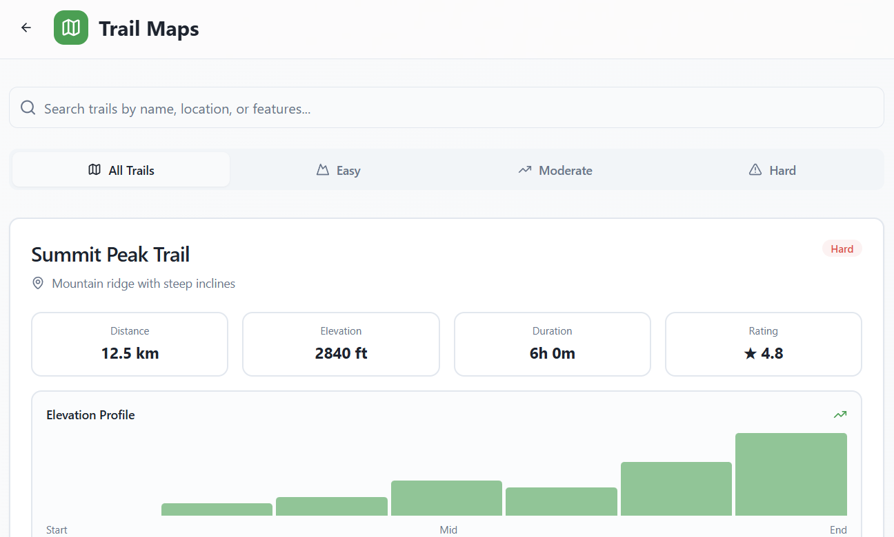

# TrailSafe ⛰️  
**Your Personal Hiking Safety Companion**

TrailSafe is a **full-stack mobile/web application** designed to keep hikers safe through **real-time anomaly detection, emergency escalation, offline-first navigation, and contextual hike planning.** Built with a polished UI/UX frontend and a robust backend, TrailSafe combines **machine learning, geolocation, weather APIs, and safety automation** into a single platform.  

---

## 🚀 Key Features  

### 🔒 Safety First
- **Anomaly Detection (Machine Learning)**  
  TrailSafe continuously monitors a hiker’s movement patterns and uses ML-based models to detect irregularities such as:  
  - **Unusual acceleration/deceleration** (e.g., sudden sprinting or slowing).  
  - **Unusual elevation drops** (e.g., falling/slipping scenarios).  
  - **Extended idleness** when moving was expected.  
  - **Erratic directional changes** inconsistent with a trail path.  
  On detection, the app issues an **Amber Alert–style nudge** (sound + vibration). If unacknowledged, it escalates by contacting **emergency contacts** with the user’s last known location, and ultimately **notifies local authorities** if no contact is established.  

- **Smart Check-In System**  
  Users set customizable check-in intervals (e.g., every 30 minutes). A timer ensures hikers confirm they’re safe. If a check-in is missed:  
  1. Emergency contacts are notified with real-time GPS location.  
  2. If unresponsive, authorities receive a full safety report.  

- **SOS One-Tap Alert**  
  A persistent emergency button lets hikers instantly alert contacts/authorities.  

---

### 🗺️ Navigation & Tracking
- **Live GPS Tracking**  
  - Records duration, location, elevation gain, and distance.  
  - **Breadcrumb Trail**: step-by-step logs of locations, timestamps, and elevation.  
  - Strong GPS accuracy indicators for reliability.  

- **Offline Maps**  
  - Download maps for major parks (Rocky Mountain, Yosemite, Grand Canyon, Zion, etc.).  
  - Offline-first mode ensures navigation works without cell service.  

- **Trail Database**  
  - Searchable by **name, location, or features**.  
  - Filter by difficulty (*Easy, Moderate, Hard*).  
  - Trail cards include distance, elevation, estimated time, community ratings, and elevation profiles.  
  - Tags for **scenic views, waterfalls, wildlife, photography spots, family-friendly terrain**, etc.  

---

### 🌦️ Contextual Awareness
- **Real-Time Weather Fetching**  
  - Integrates with external weather APIs (e.g., OpenWeather, NOAA).  
  - Displays temperature, humidity, wind speed, and trail conditions.  
  - Provides **safety advisories** for upcoming weather risks (storms, extreme heat, etc.).  

- **Wildlife Alerts (Crowdsourced + API-fed)**  
  - Real-time alerts for wildlife sightings (bear, mountain lion, rattlesnake, elk herds, coyote packs, etc.).  
  - Severity levels: **High / Medium / Low**.  
  - Each report includes location, distance from user, and timestamp.  
  - Promotes community safety through **hiker-submitted sightings**.  

---

### 🎒 Smart Gear Checklist
- Auto-generated packing list **based on hike difficulty, weather, and location**.  
- Categorized into:  
  - Essential Gear  
  - Clothing  
  - Food & Water  
  - Safety & First Aid  
  - Navigation & Communication  
- Interactive checklist with progress tracking to encourage **safe preparation**.  

---

### ⚙️ Customizable Settings
- **Profile Management** → Name, phone number, and emergency contacts.  
- **Safety Preferences** → Auto check-in toggle, interval selection, anomaly detection toggle.  
- Fully adjustable so **casual hikers and extreme adventurers** can configure safety levels.  

---

## 🛠️ Technical Architecture  

### **Frontend**
- **React + Tailwind** → Modern, responsive UI/UX optimized for mobile and desktop.  
- **Real-Time Notifications** → Modeled after Amber Alerts (sound, vibration, fullscreen popups).  
- **Offline-First Support** → Service workers & caching for offline maps and trail data.  

### **Backend**
- **Node.js + Express** REST API layer.  
- **Machine Learning Module (Python / TensorFlow Lite)**  
  - Processes motion data (GPS, accelerometer, barometer).  
  - Anomaly detection models trained on real hiking movement datasets.  
  - Threshold-based hybrid ML approach: combines statistical outlier detection + ML classifiers.  

- **Data Integration**  
  - **Weather APIs** (OpenWeather, NOAA) → real-time weather advisories.  
  - **Trail Data API** → curated database of trail information, difficulty, and reviews.  
  - **Emergency Messaging Service (Twilio, Firebase)** → sends alerts (SMS, push notifications, automated voice call fallback).  

- **Geolocation Services**  
  - GPS tracking with **breadcrumb trail logging**.  
  - Geofencing to detect when hikers deviate from marked trails.  

- **Storage**  
  - **MongoDB / PostgreSQL** for user profiles, hikes, trail logs, wildlife alerts.  
  - **Cloud Storage** for map downloads.  

---

## 📸 Screenshots  
Below are select UI views of TrailSafe in action.

### 🧭 Safety Alerts  
Anomaly detection and timed check-ins that ensure user safety on-trail.  

---

### 🥾 Active Hike Tracking  
Displays live hike data — duration, GPS path, and elevation gain.  
  
  
  
  
  
  

---

### 🎒 Smart Gear Checklist  
Organized gear preparation with category grouping and progress indicators.  

---

### 🐾 Wildlife Alerts  
Severity-ranked nearby animal sightings from other hikers in real time.  

---

### 🗺️ Offline Maps  
Downloaded maps remain accessible without cell signal.  

---

### 🏞️ Trail Maps  
Filter trails by difficulty, length, and rating, with detailed elevation profiles.  
  

---

### ⚙️ Settings  
Personal and safety configuration including anomaly detection, auto check-in, and intervals.  
  
  

  

---

## 🧠 Why TrailSafe Matters  
Hiking safety apps typically focus on maps or weather. TrailSafe goes further by:  
- **Actively monitoring hikers’ well-being** through anomaly detection.  
- **Reducing response times** during emergencies with auto-escalation alerts.  
- **Empowering hikers** with contextual awareness (weather + wildlife).  
- **Promoting preparedness** via gear checklists and pre-hike planning tools.  

---

## 💻 Tech Stack
- **Frontend**: React, TailwindCSS, Service Workers (offline support)  
- **Backend**: Node.js, Express, Python (ML)  
- **Database**: MongoDB / PostgreSQL  
- **APIs**: OpenWeather, Trail APIs, Twilio/Firebase for messaging  
- **Machine Learning**: TensorFlow Lite anomaly detection  
- **Deployment**: Dockerized backend, Vercel/Netlify for frontend  

---

## 📈 Future Enhancements
- Expand ML anomaly models with larger datasets (simulate falls, medical emergencies).  
- Wearable integration (Apple Watch, Garmin, Fitbit).  
- Community-driven wildlife database with photos + verification.  
- Real-time group tracking for hiking parties.  
